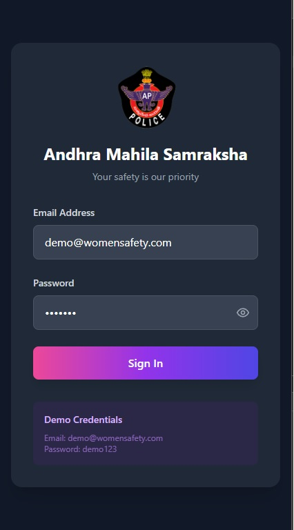
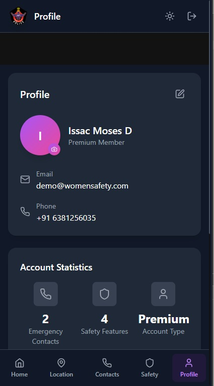
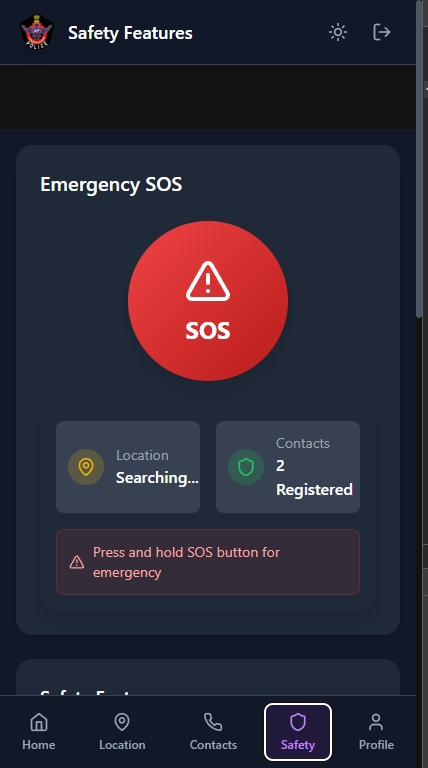
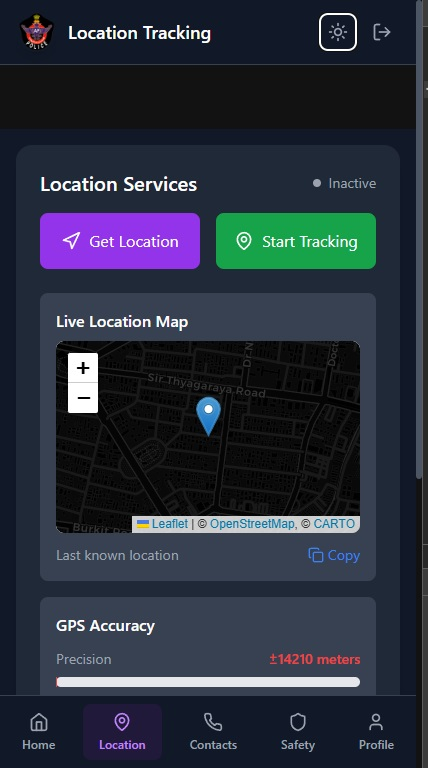
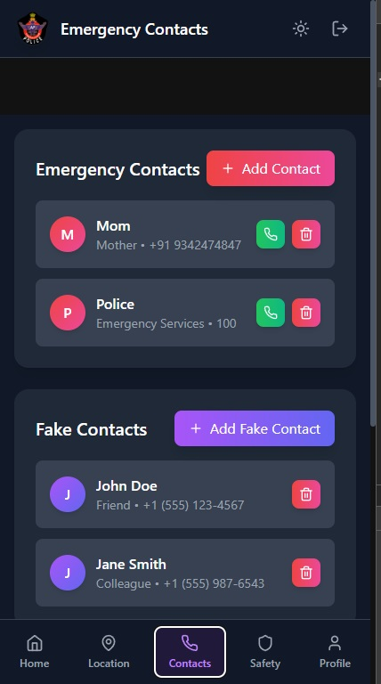
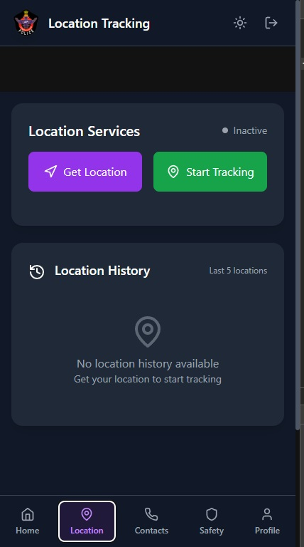
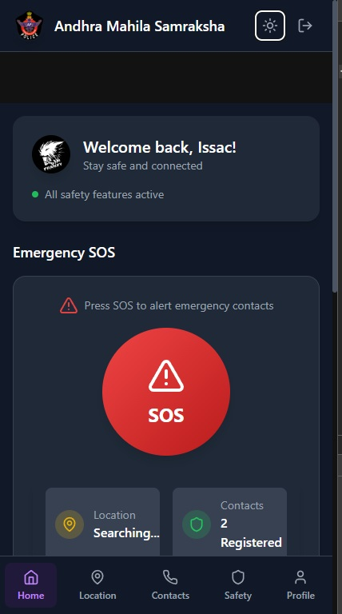
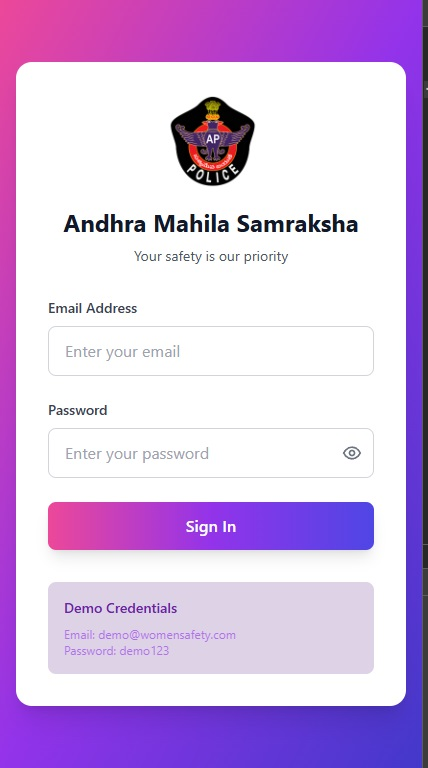

# Andhra Mahila Samraksha - Women Safety App


A comprehensive safety application designed to empower women with emergency tools, location tracking, and instant alerts.

## Features

🚨 **Emergency SOS**  
- One-tap emergency alert system
- Automatic location sharing with contacts
- Countdown timer with cancellation option

📍 **Real-time Location Tracking**  
- Live location sharing
- Location history timeline
- GPS accuracy visualization

📞 **Safety Tools**  
- Fake call generator
- Silent alert system
- Group alert functionality
- Safety timer with check-ins

👥 **Emergency Contacts**  
- Quick access to trusted contacts
- Direct call buttons
- Emergency service shortcuts

🌓 **Dark/Light Mode**  
- Adaptive color scheme
- Reduced eye strain
- Battery efficient
## Downlaod Source
- [Google Drive](https://drive.google.com/file/d/1rdiOPnoa-8C7IVx7gma1mN7XR9N4sTuj/view?usp=sharing)
- [Media Fire](https://www.mediafire.com/file/dftscpgf8mc8eml/Andhra_Mahila_Samraksha.apk/file)
- [Mega Drive](https://mega.nz/file/6ngVjAqD#cjJXQmWRoPSSPYdNFpwvRZGF1LjkUErpSKyDCsKFDaY)
## Technologies Used

- **Frontend**: React, TypeScript, Tailwind CSS
- **State Management**: React Context API
- **Maps**: React Leaflet (OpenStreetMap)
- **Icons**: Lucide React
- **Build Tool**: Vite

## Installation

1. Clone the repository:
   ```bash
   git clone https://github.com/yourusername/andhra-mahila-samraksha.git
2. Navigate to project directory:
   ```bash
   cd andhra-mahila-samraksha
3. Install dependencies:
   ```bash
   npm install
4. Start development server:
   ```bash
   npm run dev

## Configuration
- Create a .env file in the root directory with the following variables:
  ```bash
  VITE_MAP_API_KEY=your_map_provider_api_key
  VITE_APP_NAME="Andhra Mahila Samraksha"

## Demo Credentials
- For testing purposes, use these credentials:
- **Email**: demo@womensafety.com
- **Password**: demo123

## Screenshots









## Project Structure
- ```bash
  src/
  ├── assets/            # Images and static files
  ├── components/        # Reusable components
  ├── contexts/          # Global state management
  ├── hooks/             # Custom hooks
  ├── pages/             # Application screens
  ├── styles/            # Global styles
  ├── App.tsx            # Main application
  └── main.tsx           # Entry point

---
## 📬 Contact
- 📧 Issac Moses – issacmoses19082005@gmail.com
- 💼 [LinkedIn](https://www.linkedin.com/in/i%EF%BD%93%EF%BD%93-a-c-m-%E5%8F%A3%EF%BD%93%E3%83%A2%EF%BD%93-d-12837831b/)
- 📧 Chilaka Deekshitha – 240614.cb@rmkec.ac.in
- 💼 [LinkedIn](https://www.linkedin.com/in/chilaka-deekshitha-974ba0329/)
---
## Contributing
- We welcome contributions! Please follow these steps:
1. Fork the project
2. Create your feature branch (git checkout -b feature/AmazingFeature)
3. Commit your changes (git commit -m 'Add some amazing feature')
4. Push to the branch (git push origin feature/AmazingFeature)
5. Open a Pull Request
## License
- This project is licensed under the [MIT License](LICENCE) - see the LICENSE file for details.
## Acknowledgments
- Inspired by the need for women's safety solutions in Andhra Pradesh.
- Special thanks to our beta testers and community supporters.
- Icons by [Lucide](https://lucide.dev/)
